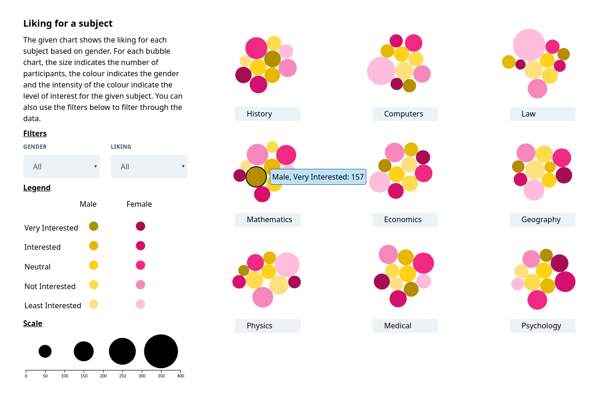

[](https://travis-ci.com/sunitdeshpande/young-people-survey)

<p align="center">
  <h3 align="center">Young People Survery.</h3>

  <p align="center">
    Scrolling data visualization of young people survey.
    <br />
    <a href="https://sunitdeshpande.github.io/young-people-survey/">View Demo</a>
  </p>
</p>


<!-- TABLE OF CONTENTS -->
## Table of Contents

- [Table of Contents](#table-of-contents)
- [About The Project](#about-the-project)
  - [Built With](#built-with)
- [Getting Started](#getting-started)
- [Installation](#installation)
- [Building](#building)


<!-- ABOUT THE PROJECT -->
## About The Project

[](https://sunitdeshpande.github.io/young-people-survey/)

In 2013, students of the Statistics class at [FSEV UK](https://fses.uniba.sk/en/) were asked to invite their friends to participate in a survey. Data consists of responses to different questions by almost 1010 different participant. The original data source can be viewed at the following [link](https://www.kaggle.com/miroslavsabo/young-people-survey).

The purpose of this visualization is to show different trends and patter than emerge in the responses given by the young participants.

### Built With

Following Frameworks, Libraries and tools are used in building this website.

* [D3](https://d3js.org/)
* [Tailwind CSS](https://tailwindcss.com/)
* [Pug](https://pugjs.org/api/getting-started.html)
* [ParceJs](https://parceljs.org/)


<!-- GETTING STARTED -->
## Getting Started

Getting started with the project is simple. First clone the project and see if you have `npm` installed in your system.


## Installation

1. Clone the repo
```sh
git clone https://github.com/sunitdeshpande/young-people-survey.git
```
2. Install NPM packages
```sh
npm ci
```
3. Start Server in development mode.
```JS
npm run serve
```

## Building

To build the website in production mode run.

```sh
npm run build
```